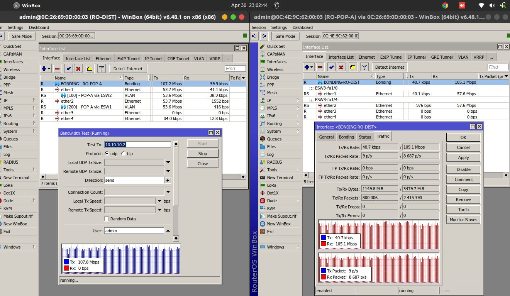

# Bonding on MikroTik
This repository provides configuration examples for **MikroTik Bonding using Round-Robin (RR) mode**.  
The scenario simulates a Metro-E service where **RO-DIST receives an access VLAN**, so bonding is configured on the **physical interfaces**, while **RO-POP-A receives a trunk VLAN**, so bonding is configured on the **VLAN interfaces**.

---

## Topology

---

## Testing
The bandwidth test results show that traffic is successfully balanced across both interfaces on both devices, thanks to the **Round-Robin bonding mode**.

---

## Devices

- **Router**: MikroTik RouterOS 6.48.1
- **Switch**: Cisco-c6640 with slot NM-16ESW

---

## Links

Origin : 
<https://github.com/andre4freelance/MikroTik-bonding>

Linkedin post : 
<https://www.linkedin.com/posts/link-andre-bastian_mikrotik-metro-man-activity-7191110146570219520-nl_M?utm_source=share&utm_medium=member_desktop&rcm=ACoAAD73JlUBty-p-mBfMEW0-O4j0sv-e_PRQvc>

Facebook post : 
<https://www.linkedin.com/posts/link-andre-bastian_mikrotik-metro-man-activity-7191110146570219520-nl_M?utm_source=share&utm_medium=member_desktop&rcm=ACoAAD73JlUBty-p-mBfMEW0-O4j0sv-e_PRQvc>

